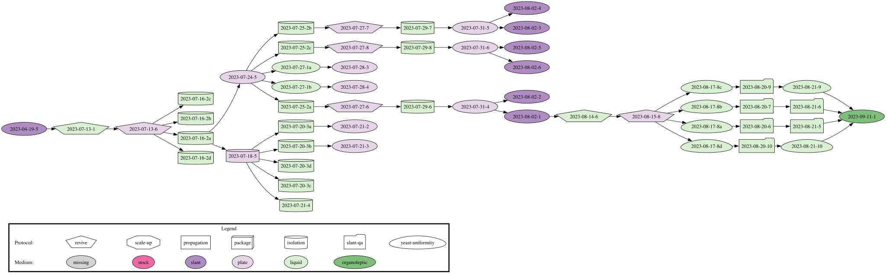
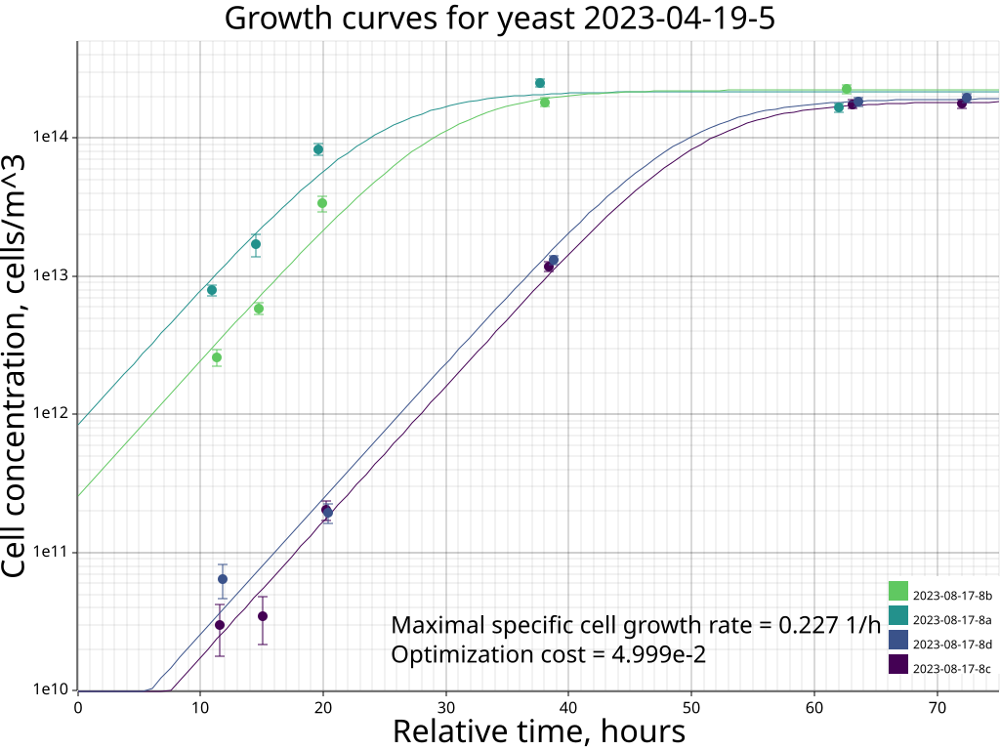

The code in this project calculates maximum specific cell growth rates (μmax) for yeast strains from multiple cell growth experiments. Knowledge of μmax for a given strain allows one to forecast when the fermentation process will be complete. Computation is done in several steps:

1) A dataset consisting of TOML files is parsed to create a graph. Each yeast-related experiment is a node in this graph. Combined data for a yeast strain corresponds to a connected component of the graph. Example below shows a connected component representing data for one yeast strain (full version). It has a lot of nodes but only nodes 2023-08-17-8a, 2023-08-17-8b, 2023-08-17-8c and 2023-08-17-8d contain cell growth experiments:

2) All data related to a given strain (data from a connected component) is combined into a (2N+1)-dimensional Nelder-Mead problem, where N is the number of cell growth experiments for the strain. In the shown example N=4, so the space is 9-dimensional. For each cell growth experiment, there are two unique parameters (initial cell concentration C0 and maximal cell concentration Cmax), plus there is one common parameter — the maximum specific cell growth rate μmax, which is constant for a given strain. Thus you have 2N + 1 parameters for each strain.

3) The maximal specific cell growth rate is calculated for each strain independently, assuming a logistic growth model. Below is an example showing the plot and optimization results for the component shown previously:

```
Ancestor ID for the component: 2023-04-19-5
Dimensionality of the optimization problem for the component: 9
Parameters for a single Nelder-Mead problem are: [C0 and CMax values (4 times), µmax]
C0 - Cell concentration at the reference time (cells/m^3)
CMax - Maximum cell concentration (cells/m^3)
µmax - Maximum specific cell growth rate (1/h)

Optimized parameters for the component: ["8.365e11", "2.175e14", "2.652e9", "1.923e14", "2.556e11", "2.230e14", "1.804e9", "1.832e14", "2.267e-1"]
Final optimization cost for the component: 0.04998560501076758
Initial simplex used for the component's optimization problem: 
[1.000e9, 1.000e14, 1.000e9, 1.000e14, 1.000e9, 1.000e14, 1.000e9, 1.000e14, 5.000e-1]
[6.000e9, 1.000e14, 1.000e9, 1.000e14, 1.000e9, 1.000e14, 1.000e9, 1.000e14, 5.000e-1]
[1.000e9, 6.000e14, 1.000e9, 1.000e14, 1.000e9, 1.000e14, 1.000e9, 1.000e14, 5.000e-1]
[1.000e9, 1.000e14, 6.000e9, 1.000e14, 1.000e9, 1.000e14, 1.000e9, 1.000e14, 5.000e-1]
[1.000e9, 1.000e14, 1.000e9, 6.000e14, 1.000e9, 1.000e14, 1.000e9, 1.000e14, 5.000e-1]
[1.000e9, 1.000e14, 1.000e9, 1.000e14, 6.000e9, 1.000e14, 1.000e9, 1.000e14, 5.000e-1]
[1.000e9, 1.000e14, 1.000e9, 1.000e14, 1.000e9, 6.000e14, 1.000e9, 1.000e14, 5.000e-1]
[1.000e9, 1.000e14, 1.000e9, 1.000e14, 1.000e9, 1.000e14, 6.000e9, 1.000e14, 5.000e-1]
[1.000e9, 1.000e14, 1.000e9, 1.000e14, 1.000e9, 1.000e14, 1.000e9, 6.000e14, 5.000e-1]
[1.000e9, 1.000e14, 1.000e9, 1.000e14, 1.000e9, 1.000e14, 1.000e9, 1.000e14, 1.000e0]
```
